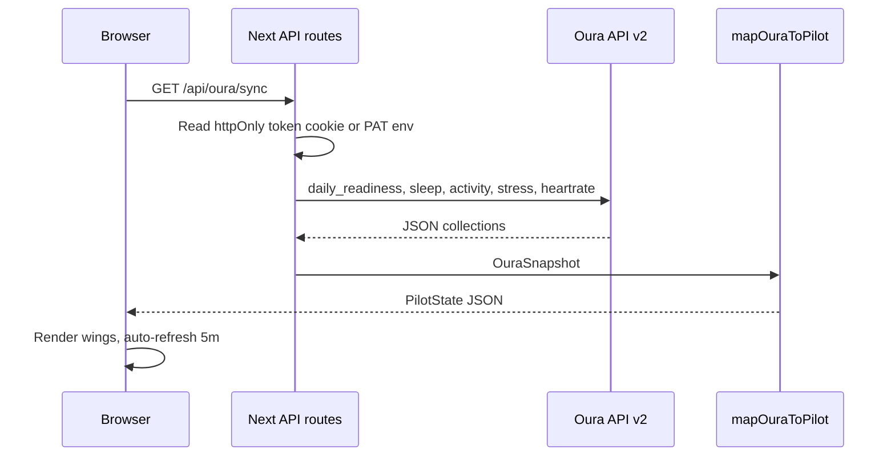

# EVA SYNC — Architecture & Oura Integration

## Vision

Web-based **Neon Genesis Evangelion** command center where **Oura Ring** biometrics drive the pilot/Eva metaphor:

| Oura field | Eva / Pilot UI |
|------------|----------------|
| Readiness score | Central **SYNC %** gauge |
| HRV / contributors | Neural link / AT field stability |
| Resting HR | Pulse |
| Temperature deviation | Pattern / fever alerts |
| Daily stress | Mental toxicity |
| Sleep score | Sleep & Recovery wing |
| Activity / strain | Strain & Activity wing (+ knee manual) |
| — | Nutrition wing (protein, IF — manual + future Apple Health) |

## Main menu (5 wings)

```
┌─────────────────────────────────────────────────────────────┐
│ NERV PILOT INTERFACE          ● OURA LIVE    [FORCE SYNC]   │
├─────────────────────────────────────────────────────────────┤
│ [STATUS] [SLEEP] [STRAIN] [NUTRITION] [TRENDS]              │
├─────────────────────────────────────────────────────────────┤
│                                                             │
│   Wing content (dense NGE panels, feeds, cascades)          │
│                                                             │
└─────────────────────────────────────────────────────────────┘
```

### Wireframe — Status wing (default)

```
┌──────────────────────┬──────────────────────┐
│     SYNC GAUGE       │   ALERT CASCADE      │
│        72%           │ ▶ READINESS LOW      │
│     READINESS        │ ▶ ALL NOMINAL        │
├──────────┬───────────┼──────────┬───────────┤
│ HRV      │ RHR       │ TEMP Δ   │ STRESS    │
│ 42ms     │ 58bpm     │ +0.1     │ 28        │
└──────────┴───────────┴──────────┴───────────┘
```

## Stack

| Layer | Choice |
|-------|--------|
| UI | Next.js 15 App Router + React 19 |
| Aesthetic | NGE CSS tokens (ported from cinematic HUD) |
| API | Route handlers `/api/oura/*` |
| Auth | OAuth 2.0 + **Personal Access Token** dev fallback |
| Deploy | Vercel |
| Legacy | `/cinematic/index.html` — Ray-Ban cinematic flow |

## Data flow



## Security & privacy

1. **Secrets only server-side** — `OURA_CLIENT_SECRET`, `OURA_PERSONAL_ACCESS_TOKEN` in `.env` / Vercel env vars; never exposed to client.
2. **Tokens in httpOnly cookies** — OAuth access/refresh after callback; no localStorage for ring credentials.
3. **Single-user personal app** — no multi-tenant DB required initially; optional SQLite later for trend history.
4. **Local-first fallbacks** — knee + nutrition manual logs in browser localStorage until Apple Health bridge exists.
5. **HTTPS only in production** — secure cookie flags on Vercel.
6. **Minimal scopes** — `daily`, `heartrate`, `personal` only what dashboards need.

## Tomorrow: ring arrival checklist

1. Create app at [Oura Cloud OAuth](https://cloud.ouraring.com/oauth/applications)
2. Set redirect URI: `https://eva-sync-hud.vercel.app/api/oura/callback` (and localhost for dev)
3. Generate **Personal Access Token** → paste in `OURA_PERSONAL_ACCESS_TOKEN`
4. `npm run dev` → verify `/api/health` and `/api/oura/sync`
5. Wear ring overnight → confirm readiness/sleep populate on Status + Sleep wings
6. Iterate: trend charts, glitch on low readiness, knee log UI

## File map

```
src/
  app/page.tsx              Dashboard shell
  app/api/oura/auth         OAuth redirect
  app/api/oura/callback     Token exchange
  app/api/oura/sync         Pull + map Oura → PilotState
  lib/oura/client.ts        API client
  lib/oura/mapper.ts        Eva metaphor mapping
  types/pilot.ts            Canonical dashboard state
  components/wings/*        Five main menu wings
public/cinematic/           Legacy NGE HUD (unchanged flow)
```